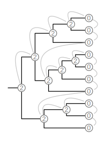
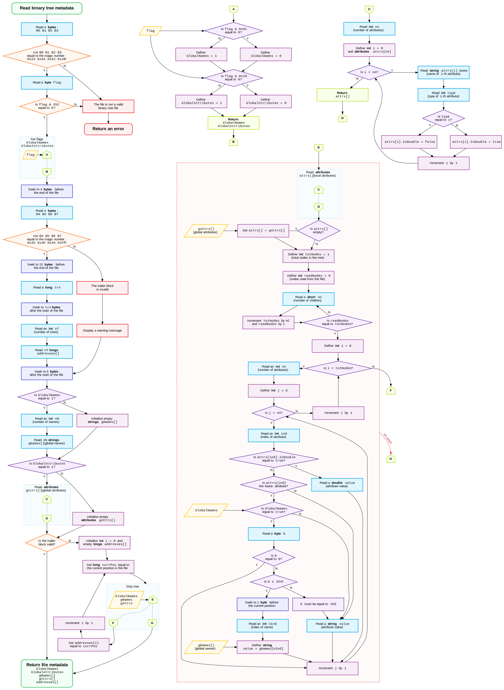

# Binary tree format

This document describes the __Binary format__ for phylogenetic trees. Note that the name refers to the way the data are stored in the file (as opposed to text-based formats) - multifurcating trees can be represented in this format without any issue.

The main motivation behind this format is to define a file format for phylogenetic trees that is _seekable_, i.e. allows out-of-order access to the stored trees. This is done by including an index in the trailer of the file. Advantages of using a binary format for this purpose include discouraging users from manually modifying the file (which would invalidate the index) and platform independency (e.g. with respect to newline characters). Furthermore, tree files in Binary format can store arbitrary additional binary data, which can be used by programs creating and consuming the files in multiple ways (e.g. to store information on how the tree was generated, or on how to display it).

Another feature of files in Binary format is that they can still be parsed correctly even if they are incomplete (e.g. the trailer block is missing). This makes it also possible to read files in Binary format while they are being written.

## File structure
A tree file in Binary format consists of four main blocks:
1. The header block
2. The tree data block
3. The (optional) additional data block
4. The trailer block

The header block contains general information about the trees in the file, the tree data block contains the actual trees, the additional data block contains arbitrary binary data which is not part of the trees represented by the file, and the trailer block contains the addresses (i.e. byte offsets from the start of the file) of the trees.

## Data types
Within the binary tree file, the following data types are used to represent different kinds of data:

| | | | | | |
| -- | -- | -- | -- | -- | -- |
| __Type__: | [`int`](#int) | [`short`](#short) | [`long`](#long) | [`double`](#double) | [`string`](#string) |
| __Size__ (bits): | `8` - `40` | `2` - `48` | `64` | `64` | `≥ 8` |
| | | | | | |

These types are described in terms of their `size` and the represented `value`. The `n`-th stored byte pertaining to each element as stored in the file is denoted `Bn` (e.g. `B0`, `B1`; `n` starts at `0`). The `n`-th bit is denoted `bn` (`b0` is the least significant bit of a byte, `b7` is the most significant bit).

###  Integer `int`
Variable `size` (between 1 and 5 bytes).
- `B0 < 254` ⇒ `value = B0`
- `B0 == 255` ⇒ special code
- `B0 == 254` ⇒ `value = B1 + (B2 * 2⁸) + (B3 * 2¹⁶) + (B4 * 2²⁴)`

###  Short integer `short`
Variable `size` (between 2 bits and 6 bytes). A `short` may be smaller than a full byte. If this is the case and the next object is also a `short`, the remaining bits are used for the other `short`. If a `short` is followed by any other type, the byte containing it is padded with `0`s as necessary to reach a byte boundary.
- `(b0, b1) = (0, 0)` ⇒ `value = 0`
- `(b0, b1) = (0, 1)` ⇒ `value = 2`
- `(b0, b1) = (1, 0)` ⇒ `value = 3`
- `(b0, b1) = (1, 1)`:
    - `(b2, b3) = (0, 0)` ⇒ `value = 1`
    - `(b2, b3) = (0, 1)` ⇒ `value = 4`
    - `(b2, b3) = (1, 0)` ⇒ `value = 5`
    - `(b2, b3) = (1, 1)` ⇒ ignore the rest of `B0`:
        - `B1 < 254` ⇒ `value = B1`
        - `B1 == 255` ⇒ special code
        - `B1 == 254` ⇒ `value = B2 + (B3 * 2⁸) + (B4 * 2¹⁶) + (B5 * 2²⁴)`

###  Long integer `long`
Fixed `size` (8 bytes).

`value = B0 + (B1 * 2⁸) + (B2 * 2¹⁶) + (B3 * 2²⁴) + (B4 * 2³²) + (B5 * 2⁶⁴) + (B6 * 2¹²⁸) + (B7 * 2²⁵⁶)`.

###  Floating-point number `double`
Fixed `size` (8 bytes). A `64`-bit IEEE754-encoded floating point number [[1]](https://doi.org/10.1109/IEEESTD.2019.8766229).

###  String `string`
Variable `size` (at least 1 byte). A `string` consists of an `int` (`n`), representing the length of the string, followed by `n` other `int`s, each representing the UTF-16 value of a character.

## 1. Header block
The header block is at least 5 bytes long and contains general information about the trees in the file. It consists of the following:

1. Magic number (`4` bytes)
2. Flags (`1` byte)
3. Global names (optional)
4. Global attributes (optional)

### 1.1 Magic number
Bytes `0`-`3` are the format's magic number and should be equal to `0x23 0x54 0x52 0x45` (spelling `#TRE` in ASCII).

### 1.2 Flags

The two least significant bits of byte `4` (`B4`) specify the `GlobalNames` and `GlobalAttributes` flags:
- `GlobalNames ← (B4 & 0b00000001) != 0`
- `GlobalAttributes ← (B4 & 0b00000010) != 0`

The six most significant bits of `B4` must all be equal to `0`.

Depending on `GlobalNames` and `GlobalAttributes`, additional data may be contained in the header.

### 1.3 Global names
If `GlobalNames` is `true`, it means that some "global names" are stored in the header. This is useful to reduce file size when the file contains many trees all with the same tip labels.

The next `int` after the flags describes how many names follow. Each name is a `string`. There are no delimiters between consecutive names.

### 1.4 Global attributes

If `GlobalAttributes` is `true`, it means that some "global attributes" are stored in the header. This is useful to reduce file size when the file contains many trees all with the same attributes.

The next `int` after the global names (if any) or after the flags describes how many attributes follow. Each attribute consists of a `string` representing the name of the attribute, followed by an `int` representing the attribute type (`t`):
- If `t = 1`, the attribute is a `string`
- If `t = 2`, the attribute is a `double`
    
If the attribute can have values of both types, it must be repeated twice.

## 2. Tree data block

The tree data block contains the data about the topology of the tree and attributes of its nodes. It consists of multiple "tree units" repeated one after the other (without any delimiter).

A tree unit consists of the following:

1. A list of attributes.
2. The tree topology.
3. The attributes associated with each node.

### 2.1 List of attributes
This consists of an `int` describing how many attributes (`n`) are defined (this can be `0`), followed by `n` attributes.

If `n = 0`, the attributes for the current tree are the same as the global attributes defined in the header. Otherwise, the list in the header is ignored for the current tree, and the list of local attributes defined here represents the attributes for the current tree.

Each attribute consists of a `string` representing the name of the attribute, followed by an `int` representing the attribute type (`t`):
- If `t = 1`, the attribute is a `string`
- If `t = 2`, the attribute is a `double`

### 2.2 Tree topology

The tree topology is represented as a series of `short`s. The first `short` represents the number of children of the root node. Each following `short` represents the number of children of the last "unfinished" node. For example, the value `2 2 0 0 0` represent the topology that in parenthetic format would be represented as `((,),)`.

For a more complicated example, the tree on the right can be represented as `2 2 2 2 0 0 0 2 0 2 0 2 0 0 2 0 2 0 0`. The parenthetic representation of the tree would be `((((,),),(((,),),)),((,),))`.

Note that this representation is self-limiting (i.e., it is possible to determine whether the end of the topology has been reached without external information such as the length in bytes).

### 2.3 Attributes associated with each node

This consists of one list of attributes for each node in the tree (as defined in the topology). Each list of attributes consists of an `int` representing the number of attributes (`n`) defined for the current node, followed by `n` pairs of attribute index and value.

The attribute index is the index of the current attribute in the list of attributes for the current tree (i.e. the global attributes or the local attributes). Indices start at `0`.

The attribute value is a `string` or a `double`, depending on the attribute type (which was defined in the list of attributes).

For the attribute called `Name` of type `string`, the following special syntax is used:
 - If no list of global names has been defined, the value can be read as a normal `string`.
 - Otherwise, the value of the attribute is determined by the first byte `B0`:
    - If `B0 = 0`, the node's name is empty.
    - If `1 ≤ B0 ≤ 254`, `B0` is the first byte of an `int` `i`. The node's name is the `(i - 1)`-th element of the global list of names.
    - If `B0 == 255`, the node's name does not appear in the list of global names and is specified by a `string` following `B0`.

## 3. Additional data block

This block is optional and may contain binary data of any format and any interpretation.

## 4. Trailer block

The trailer block is useed to store the addresses of the trees contained in the file. It consists of the following:

1. Tree addresses
2. Address of trailer block
3. Magic number

If the trailer block is missing or invalid, a compliant parser should still be able to extract the trees from the file after emitting a warning, since all the structures in this format are self-limiting (with the exception of the additional data block).

### 4.1 Tree addresses

The trailer stores the addresses of all the trees included in the file. At the start of the trailer, an `int` defines how many addresses follow. Each address is a `long` representing the byte offset from the start of the file at which the topology the tree starts.

### 4.2 Address of trailer block

After the tree addresses, a `long` follows, representing the address of the trailer block. This makes it possible to reach the start of the trailer without parsing the whole file, as this element always starts `12` bytes before the end of the file.

### 4.3 Magic number
The last four bytes of the file represent another magic number and should be equal to `0x45 0x4E 0x44 0xFF` (the first three characters spell `END` in ASCII).

## Metadata parsing flowchart

The following flowchart illustrates how a compliant parser should parse the metadata information from a tree file in binary format (click on the image to view a larger version).

## References
[1] IEEE (2019). IEEE Standard for Floating-Point Arithmetic. IEEE Std 754-2019 (Revision of IEEE 754-2008) [https://doi.org/10.1109/IEEESTD.2019.8766229](https://doi.org/10.1109/IEEESTD.2019.8766229)

