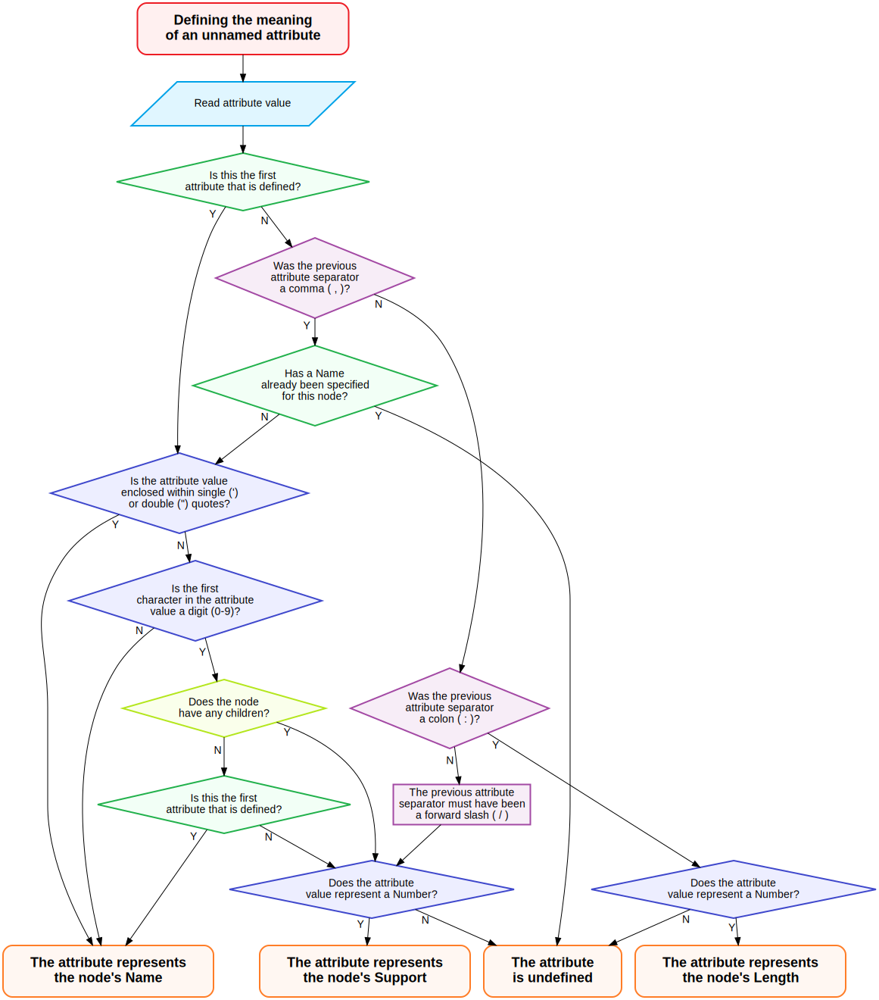

# Newick-with-Attributes format

This document describes the __Newick-with-Attributes__ (__NWKA__) format for phylogenetic trees. This format derives from the Newick format [[1]](http://evolution.genetics.washington.edu/phylip/newicktree.html), with which it is backwards-compatible (i.e. valid Newick trees are also valid NWKA trees).

The main motivation behind this new format is to define a single tree format that is compatible with the output produced by popular phylogenetics software such as MrBayes [[2]](https://doi.org/10.1093/bioinformatics/btg180), BEAST [[3]](https://doi.org/10.1093/ve/vey016) and others.

These programs produce NEXUS format tree files, which contain `Tree` blocks that define the trees in a Newick-like manner. Due to the lack of standardisation for the specification of custom node attributes, these programs define attributes in NEXUS comments (i.e. text enclosed within square brackets `[]`); programs that do not understand these common attributes can simply ignore the comments.

However, the lack of a common standard to define attributes can make files produced by different programs mutually incompatible. The aim of the NWKA format is to be compatible with these existing formats, while providing flexibility in defining node attributes, in order to accommodate the future needs of phylogenetics software.

In addition to the base Newick format and to trees inside NEXUS files, the Newick-with-Attributes format is also compatible with other extensions to the Newick format, e.g. the New Hampshire X format [[4]](https://home.cc.umanitoba.ca/~psgendb/doc/atv/NHX.pdf), the Rich Newick format [[5]](https://wiki.rice.edu/confluence/display/PHYLONET/Rich+Newick+Format) and the Extended Newick Format [[6]](https://doi.org/10.1186/1471-2105-9-532) (in the sense that files in these formats should be parsed correctly by a NWKA parser - whether they are _interpreted_ correctly is up to the consumer code).

## Tree
The parsable unit of the Newick-with-Attributes format is the `Tree`. A `Tree` in is defined as a `Node` followed by a semicolon (`;`).

```
Tree := Node;
```

## Node
A `Node` in Newick-with-Attributes format is defined by a pair of round brackets (`()`) containing 0 or more `Node`s (which are the "children" of the `Node`), followed by a list of 0 or more attributes. 

```
Node := (children)attributes
```

The children are specified as a list of comma-separated `Node`s, while the attributes are specified as a dictionary of `key=value` entries, separated by a colon (`:`), a forward slash (`/`) or (only in special cases) a comma (`,`).

For example, `(child1,child2)Name=parent:Length=1` defines a node with two children (`child1` and `child2`), whose `Name` is `parent` and whose `Length` is `1`.

Two standard attribute types are defined:
 - `String`: represents a series of characters (encoded according to ISO/IEC 646, a.k.a. ASCII).
 - `Number`: represents a floating point number.

Three standard attributes are defined:
 - `Name`, of type `String`: specifies the name of the node.
 - `Length`, of type `Number`: specifies the length of the branch leading to the node.
 - `Support`, of type `Number`: specifies the "support" of the node (e.g. bootstrap support or posterior probability).

Compliant software can define any number of additional attribute names or attribute types, provided that the attribute value can be stored as a `String` (e.g. a complex object could be stored as its JSON representation). `Number`s are stored by converting them to their base-10 (decimal) string representation.

While decoding the value of an attribute, compliant parsers should parse it according to their expectation of the attribute type (e.g. `String` for `Name`, `Number` for `Length`). If the parsing fails, they should either emit a warning/error and terminate processing of the `Node`, or preserve and store the string representation of the attribute. When a compliant parser encounters an attribute whose name it does not recognise, it should preserve and store the string representation of its value.

`String` `value`s can optionally be enclosed within single (`'`) or double (`"`) quotes. The quotes are not part of the `value`. This makes it possible to specify attribute `value`s containing separator characters (`:`, `/`, `,`). Quotes within quotes can be represented by escaping the inner quote character using a backslash (`\`) character (e.g. `"\""`). Backslashes may be represented by escaping them with another backslash (e.g. `\\`). If the `value` is not enclosed in quotes, separator characters can be escaped with a backslash (e.g. `\:`).

The following conventions apply when describing a `Node`:

 - A pair of empty round brackets (`()`, which occurs if the `Node` does not have any children) can be omitted.
 - Attribute names are case insensitive.

[](https://raw.githubusercontent.com/arklumpus/TreeNode/master/AttributeHeuristicFlowChart.gv.svg)

 - Attribute names for some or all attributes can be omitted. This means that some entries in the `attributes` dictionary may only contain the `value` rather than a `key=value` pair. In this case, the following heuristic is used to determine which attribute is being provided (this is also represented in the flowchart on the right - click on the figure for a bigger version):
	 - If the unnamed attribute is the first attribute to be specified _OR_ the previous attribute separator is a comma (`,`, see below for when this is acceptable) _AND_ a `Name` has not yet been specified for the `Node`, then
		- If the attribute value is enclosed within single (`'`) or double (`"`) quotes _OR_
		- If the first character of the attribute value is not a digit (`0-9`) _OR_
		- The `Node` does not have any children _AND_ the unnamed attribute is the first attribute to be specified
			-	Then it is assumed that the unnamed attribute is the `Name` of the `Node`.
		- Otherwise
			- If the attribute value represents a `Number`, it is assumed that it represents the `Support` of the `Node`.
			- Otherwise, the meaning of the attribute is undefined; however, this should not cause a compliant parser to fail.

	- If the previous attribute separator is a colon (`:`), then
		- If the attribute value represents a `Number`, it is assumed that it represents the `Length` of the `Node`.
		- Otherwise, the meaning of the attribute is undefined; however, this should not cause a compliant parser to fail.
	- If the previous separator is a forward slash (`/`), then
		- If the attribute value represents a `Number`, it is assumed that it represents the `Support` of the `Node`.
		- Otherwise, the meaning of the attribute is undefined; however, this should not cause a compliant parser to fail.

	- Otherwise, the meaning of the attribute is undefined; however, this should not cause a compliant parser to fail.

- Some or all of the attributes can be enclosed within square brackets (`[]`). In this case, in addition to colon (`:`) and forward slash (`/`), a comma (`,`) is also a valid attribute separator.
- An ampersand (`&`), an exclamation mark (`!`) or an ampersand followed by an exclamation mark (`&!`) at the start of an attribute name are ignored.
- If no `Support` attribute is specified and a `prob` attribute is specified, the value of the `Support` attribute is taken to be equal to the `prob` attribute (the `prob` attribute is also retained).

The following are all examples of valid `Node`s:
|Conventional syntax| Expanded syntax |
|--|--|
| `LeafNode` | `()Name=LeafNode` |
| `(A:1,B:2)0.5:3` | `(()Name=A:Length=1,()Name=B:Length=2)Support=0.5:Length=3` |

## References
[1] Felsenstein, J. (1986). The Newick tree format. [http://evolution.genetics.washington.edu/phylip/newicktree.html](http://evolution.genetics.washington.edu/phylip/newicktree.html)

[2] Ronquist, F., & Huelsenbeck, J. P. (2003). MrBayes 3: Bayesian phylogenetic inference under mixed models. Bioinformatics, 19(12), 1572–1574. [https://doi.org/10.1093/bioinformatics/btg180](https://doi.org/10.1093/bioinformatics/btg180)

[3] Suchard, M. A., Lemey, P., Baele, G., Ayres, D. L., Drummond, A. J., & Rambaut, A. (2018). Bayesian phylogenetic and phylodynamic data integration using BEAST 1.10. Virus Evolution, 4(1). [https://doi.org/10.1093/ve/vey016](https://doi.org/10.1093/ve/vey016)

[4] Zmasek, Christian M. (2001). The New Hampshire X Format (NHX). [https://home.cc.umanitoba.ca/~psgendb/doc/atv/NHX.pdf](https://home.cc.umanitoba.ca/~psgendb/doc/atv/NHX.pdf)

[5] Barnet, Robert M. (2012). Rich Newick Format. [https://wiki.rice.edu/confluence/display/PHYLONET/Rich+Newick+Format](https://wiki.rice.edu/confluence/display/PHYLONET/Rich+Newick+Format)

[6] Cardona G, Rosselló F, Valiente G. (2008). Extended Newick: it is time for a standard representation of phylogenetic networks. BMC Bioinformatics, 9(532) [https://doi.org/10.1186/1471-2105-9-532](https://doi.org/10.1186/1471-2105-9-532)
